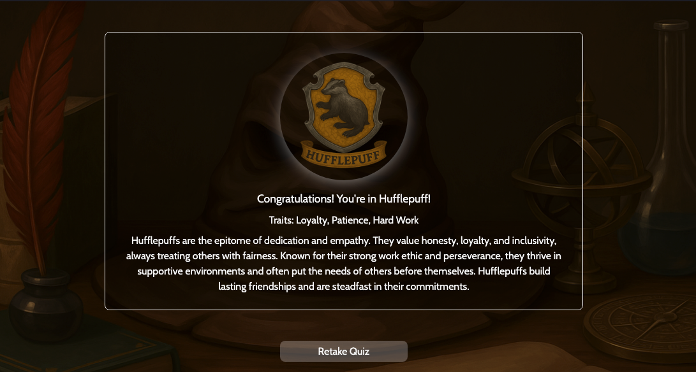
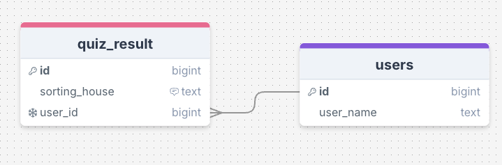
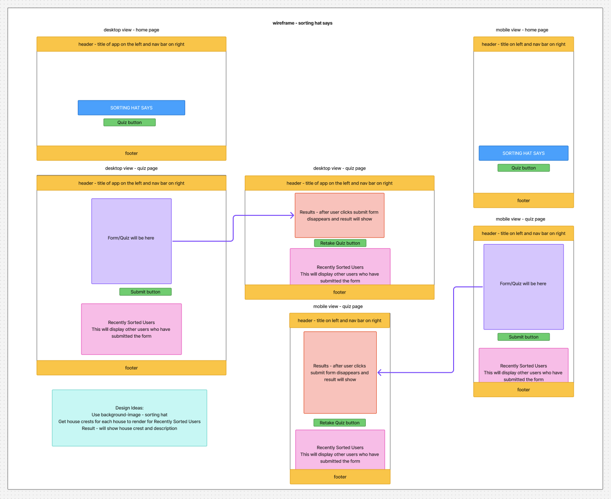

# Build a Database-Driven React App

Week 7 Assignment - Build a Database Driven Full-Stack React & Express App

Sorting Hat Says is a fun, interactive personality quiz inspired by the Hogwarts houses. Users answer a series of questions to discover which house they belong to based on their traits, and the app stores their results while providing an engaging, magical-themed experience.

## Requirements
- 🎯 Create a client using React. ✅
- 🎯 Use Express to create your server, using both GET and POST endpoints. ✅
- 🎯 Build a React form for users to create posts. ✅
- 🎯 Create multiple pages using React Router. ✅
- 🎯 Design a database schema, and seed the database with some realistic data. ✅
- 🎯 Use SQL to retrieve posts from the database in your Express server. ✅
- 🎯 Display all posts using .map(). ✅
- 🎯 Use an interval and useEffect() to poll your database. ✅

## Stretch Requirements
- 🏹 Create dynamic pages using react-router-dom. ❌
- 🏹 Use react-router-dom to create a dedicated route for the categories. ❌ 
    - For example, /posts/:categoryName.
- 🏹 Allow users to delete posts. ❌
- 🏹 Add ‘like’ functionality on posts. ❌
- 🏹 Create additional SQL queries to show filtered posts. ✅

## Reflection
This week, we were tasked with creating a full-stack application that can submit and retrieve data from a database using React and Express. While this is similar to the work we completed in week 4 and during the group project, the key difference for this assignment was the use of React for the front-end.

For my project, I decided to create a Hogwarts-style personality quiz, where users can discover which house they belong to based on their responses to a series of questions. For the database, I chose to store only the quiz results rather than the full form data. With this approach, I anticipated a significant amount of logic would be required to calculate and store the results accurately. This is where I encountered the main challenges of the assignment, as implementing this logic proved more complex than I initially expected.

There were many instances where my code did not behave as expected, which required me to try multiple approaches to debug it. I used ```console.log()``` extensively to track the flow of data and carefully reviewed documentation to identify issues. Some errors were my own, such as mistyping a ternary operator in one of my components, which caused it to render the opposite of what I intended. 

After overcoming these difficulties, the form now works as intended, and the logic functions correctly. Each time a user submits the form, they can accurately see which Hogwarts house they belong to based on their responses, fulfilling the main objective of the application.

For the background, I wanted to keep the same image across the app but make the quiz page a little different by adding a darker overlay. I looked into how to do this and found that ```useLocation()``` could help me change the background depending on the page. On the quiz page, once a user submits the form, the form disappears and their result shows up in the same /quiz route — it just swaps the form for the result. The screenshot below shows how it would look like:

<div align=center>

</div>

When I tested this locally, it worked perfectly. But after pushing my updates to GitHub and deploying on Render, I ran into a problem: once the result showed up, the background image disappeared and only the background color was showing. After doing some research, I realized this happened because my background images were stored in src/assets/images, and Render couldn’t find them. To fix it, I moved everything into the public folder in my client, and that solved the issue.

This assignment definitely pushed me when it came to JavaScript logic, especially figuring out how to calculate and display the correct result for each user. Honestly, that part felt like a stretch goal on its own, so I decided not to push too hard on the extra stretch goals — for the sake of my own sanity. Once everything was working and the database was storing results correctly, I could finally breathe a sigh of relief. I’m also really happy with how the styling turned out, especially the way the result shows up after submission — it feels clean and satisfying. 

## Wireframe 
For the planning, I initially started with drawing up how I want my database schema to look like. I use [drawSQL](https://drawsql.app/) to do this. 

<div align=center>

</div>

In designing the wireframe, my goal for the home page was to keep it minimal, featuring only the title and a button to direct users to the quiz. I stayed close to the original wireframe overall, but made a few adjustments during development. On the home page, I added a brief description so users immediately understand the purpose of the app. I also incorporated different background images to create contrast between pages: the home page uses a brighter version to feel welcoming, while the quiz page features a darkened background to help users focus on the task.

<div align=center>

</div>

## Errors or Bugs
When I tested the dummy data in my database, everything worked fine. But after I built the form and tried submitting real responses, I noticed that the quiz_result table was receiving NULL values. The issue was that I had only set up the POST endpoint for quiz_result, so while the responses were being saved, the user_id was coming through as NULL because I hadn’t fetched it yet. Once I implemented fetching the user_id and included it in the request, the responses started saving correctly.

<div align=center>

</div>

## Resources 
- https://developer.mozilla.org/en-US/docs/Web/JavaScript/Reference/Global_Objects/Object/entries
- https://developer.mozilla.org/en-US/docs/Web/JavaScript/Reference/Global_Objects/Array/sort
- https://developer.mozilla.org/en-US/docs/Web/JavaScript/Reference/Global_Objects/Object/values 
- https://developer.mozilla.org/en-US/docs/Web/CSS/background-position
- https://www.geeksforgeeks.org/web-tech/express-js-req-params-property/ 
- https://www.w3schools.com/sql/sql_check.asp 
- https://reactrouter.com/api/components/NavLink 
- https://reactrouter.com/api/hooks/useLocation 

## Disclaimer
This website is created as part of a student project for educational purposes only. All franchise-related materials are the property of their respective copyright holders. No copyright infringement is intended.